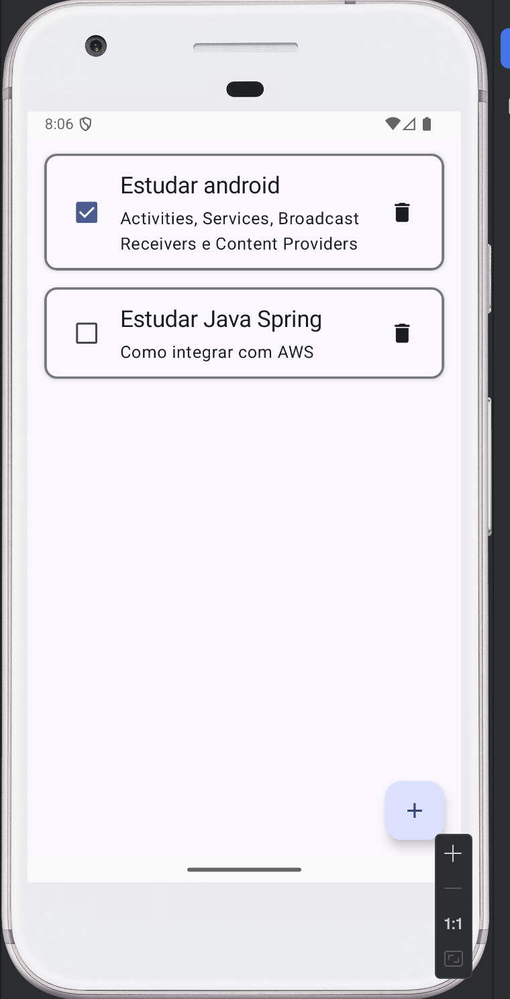

# 📱 ToDoList Android App

Aplicativo de lista de tarefas (To-Do List) desenvolvido para Android com foco em **boas práticas de arquitetura**, **persistência local eficiente** e **UI moderna declarativa**.

---

## Telas


&nbsp;&nbsp;

&nbsp;&nbsp;


## Tecnologias e Bibliotecas Utilizadas

Principais ferramentas e dependências usadas no projeto:

* **Kotlin** — linguagem principal
* **Jetpack Compose** — construção de interface declarativa e moderna
* **Room Database** — persistência local de tarefas
* **Navigation Compose (NavHost)** — navegação entre telas
* **Kotlin Serialization** — serialização de dados
* **KSP (Kotlin Symbol Processing)** — geração de código em tempo de build
* **Material 3** — componentes visuais modernos
* **Android Lifecycle + Activity Compose** — gerenciamento de estado e ciclo de vida

---

## Arquitetura

O projeto segue o padrão **MVVM (Model-View-ViewModel)**, garantindo:

* Separação clara de responsabilidades
* Código mais testável
* Melhor manutenção e escalabilidade
* Estado desacoplado da UI

---

## Configuração do Projeto

### Requisitos

* Android Studio atualizado
* SDK 36
* Java 11
* minSdk 24

---

### Build

```bash
./gradlew build
```

Ou simplesmente execute pelo Android Studio.

---

## Persistência de Dados

O app utiliza **Room** para armazenar tarefas localmente:

* Armazenamento offline
* Queries tipadas
* Integração com coroutines
* Segurança de schema

---

## Navegação

A navegação entre telas é feita com **Navigation Compose**, permitindo:

* Rotas tipadas
* Transições controladas
* Estrutura escalável de telas

---

## Interface

A interface é construída 100% com **Jetpack Compose + Material 3**, oferecendo:

* UI reativa
* Código mais limpo
* Componentização
* Preview em tempo real

---

## Objetivo do Projeto

Este projeto foi criado para:

* Praticar desenvolvimento Android moderno
* Consolidar uso de Compose + Room + MVVM
* Servir como base para apps maiores
* Demonstrar boas práticas de arquitetura

---
